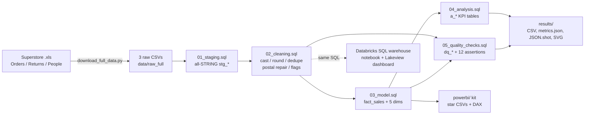

# da-learn-03 - Retail Superstore sales (SQL cleaning -> star schema -> KPIs -> dashboards)

**Data Analyst learning series, project 03.** An end-to-end analyst workflow on the real **Tableau Sample Superstore**
workbook (US retailer, 2018-2021: **9,994 order lines, 800 return rows, 4 regional managers**): SQL data cleaning,
a star-schema model, profit / discount / shipping analysis, data-quality evidence, and dashboard packages for
**Databricks** (executed + published) and **Power BI** (kit).

* SQL is written in the **Databricks / Spark SQL dialect** and executed locally on **DuckDB** (a 4-macro shim covers the differences).
* All reported numbers come from the **full dataset** run. Git holds a reproducible 66-line subset (see [Dataset](#dataset)).
* **Databricks:** schema `workspace.da_learn_03`, notebook + published Lakeview dashboard **"da-learn-03 Retail Superstore sales"**.


## Business questions
1. How much do we sell and earn, and which **regions** (and their managers) drive or drain profit?
2. What is the **discount impact** on margin? At what discount level do lines start losing money?
3. Which **sub-categories, products and states** lose money, and is discounting the cause?
4. How are **shipping modes** used (mix, speed, margin, returns) and do segments choose differently?
5. How fast is the business growing year over year, and how clean is the source workbook?

## Pipeline


## Key insights (full data)
| # | Insight |
|---|---|
| 1 | **$2.30M sales, $286.4k profit, 12.47 % margin** over 5,009 orders (9,993 clean lines). Sales grew **+29.5 %** in 2020 and **+20.4 %** in 2021 to $733k. |
| 2 | **Regional profit:** West (Anna Andreadi) earns **$108.4k at 14.94 %** margin, East **$91.5k / 13.49 %**, South **$46.7k / 11.93 %**, Central (Kelly Williams) only **$39.7k / 7.92 %** with the highest average discount (**24.0 %**). |
| 3 | **Discounts above 20 % destroy profit:** undiscounted lines earn **29.5 %** margin; 21-30 % discounts **-10.1 %**, 31-50 % **-24.8 %**, >50 % **-119.2 %** (856 lines, all loss-making, -$76.6k). Tables (**-$17.7k**, 26 % avg discount), Bookcases (-$3.5k) and Supplies (-$1.2k) lose money; Texas (**-$25.7k**, 37 % avg discount), Ohio, Pennsylvania, Illinois and North Carolina are the loss-making states. |
| 4 | **Shipping:** Standard Class carries **59.8 %** of orders (5.0 days avg); Same Day is 5.3 % (0.04 days). Margins are flat across modes (12.1-13.9 %), so mode is not a profit lever; West has the highest order return rate (**11.73 %** vs 2.9-3.3 % elsewhere, overall 5.91 %). |

Full write-up with data-quality findings: [`results/RESULTS.md`](results/RESULTS.md).

## Dataset
| | |
|---|---|
| Name | Tableau **Sample - Superstore** (US), 3 sheets: Orders, Returns, People |
| Kaggle page | https://www.kaggle.com/datasets/vivek468/superstore-dataset-final (Orders sheet as CSV) |
| Mirror used | https://raw.githubusercontent.com/chuawt-archive/datasets/master/superstore/sample_superstore_2021.xls (Tableau workbook archived 2021-07-08; SHA-256 pinned) |
| Licence | Tableau sample data, distributed freely for training/demo use; Kaggle page lists it under **"Other"**. Not for commercial redistribution claims - attribution to Tableau. |
| Full size used | 1 workbook (3.4 MB) -> orders.csv 9,994 x 21, returns.csv 800 x 2, people.csv 4 x 2 |
| In git | **Subset** in `data/raw/`: all lines of orders whose order number % 160 = 0 (66 lines / 33 orders), their returns (7) and all 4 people rows. See [`data/README.md`](data/README.md) |

## Cleaning steps (sql/02_cleaning.sql) - full-data counts
| Step | Result |
|---|---|
| Type casting with `TRY_CAST` (dates, money, qty, discount) | 0 unparseable values |
| Round float artefacts (e.g. `731.9399999999999`) | 5,296 sales values rounded to 2 dp |
| Postal code repair (Excel dropped leading zeros, `2920` -> `02920`) | 438 rows repaired; 11 missing (Burlington, VT) kept as NULL |
| Exact duplicate lines (same order/product/values, new row_id) | 9,994 -> **9,993** |
| Returns sheet: one row per returned line, no line id -> order grain | 800 -> **296 returned orders** (0 orphans) |
| Chronology / ranges | 0 ship_date < order_date; discount in 0-0.8; sales, qty > 0 |
| Outlier flags (kept) | 668 sales > Q3+3*IQR; 200 profit outside p1-p99 |
| Product ID not unique (32 ids carry 2 names) | dim_product keyed on (product_id, product_name) -> 1,894 products |
| Star schema (03) | fact_sales 9,993; dim_date 1,236; dim_customer 793; dim_product 1,894; dim_geography 632; dim_ship_mode 4 |
| Assertions (05) | **12 / 12 PASS** |

## How to run
```bash
pip install -r requirements.txt
python run_pipeline.py --source sample              # subset in git -> powerbi/data, results/sample/JSON.shot
python scripts/download_full_data.py                # workbook -> data/raw_full/{orders,returns,people}.csv (checksum-verified)
python run_pipeline.py --source full                # -> data/clean_full/star, results/ (tables, metrics.json, JSON.shot, charts)
python scripts/build_databricks.py --with-dashboard # regenerate notebook + dashboard JSON from sql/
```
* **Databricks**: [`databricks/SETUP.md`](databricks/SETUP.md). **Power BI**: [`powerbi/BUILD_GUIDE.md`](powerbi/BUILD_GUIDE.md).

## Databricks run (2026-10-02)
| Object | Location |
|---|---|
| Raw CSVs (full) | `/Volumes/workspace/da_learn_03/raw/` |
| Tables | `workspace.da_learn_03` (stg_*, cln_*, dim_*, fact_sales, a_*, dq_*) |
| Notebook | `/Workspace/Shared/da-learn-03-retail-superstore-sales/superstore_pipeline_notebook` |
| Dashboard (published) | **"da-learn-03 Retail Superstore sales"** - 2 pages, 8 data visuals (2 KPI counters, 6 charts) |

Executed on the Serverless Starter Warehouse: **all 12 core tables match DuckDB row-for-row**; KPI, region, discount and ship-mode tables
match cell-for-cell. Only difference: `percentile_approx` (approximate on Spark) flags 198 vs 200 profit extremes. Details:
[`databricks/run_outputs/duckdb_vs_databricks.json`](databricks/run_outputs/duckdb_vs_databricks.json).

## Repo layout
```
run_pipeline.py              # runs sql/00..05 on DuckDB, exports CSV/JSON, renders SVG charts
pipeline.json                # project config (files, star tables, snapshot queries, Databricks names)
sql/
  00_duckdb_compat.sql       # DuckDB-only shims for Spark functions (skip on Databricks)
  01_staging.sql             # raw CSV -> all-STRING stg_orders / stg_returns / stg_people
  02_cleaning.sql            # cln_orders / cln_returns / cln_people
  03_model.sql               # fact_sales + dim_date/customer/product/geography/ship_mode
  04_analysis.sql            # a_* KPI tables (11 business questions)
  05_quality_checks.sql      # dq_row_counts, dq_null_rates, dq_issues, dq_assertions
scripts/
  download_full_data.py      # workbook from mirror + SHA-256 + sheet -> CSV export
  make_sample.py             # deterministic subset -> data/raw
  make_charts.py, svgmin.py  # vector-only SVG dashboard + charts
  build_databricks.py, dashboard_def.py, lakeview.py   # notebook + Lakeview dashboard generator
data/raw/                    # subset CSVs (in git); data/README.md
databricks/                  # notebook, .lvdash.json, SETUP.md, run_outputs/
powerbi/                     # data/ (sample star CSVs), measures.dax, model.md, dashboard_spec.md, BUILD_GUIDE.md
results/                     # RESULTS.md, metrics.json, JSON.shot, charts/*.svg, sample/JSON.shot (tables/*.csv regenerated by the full run)
```

## SQL dialect notes
02-05 are Spark SQL. DuckDB runs them after `00_duckdb_compat.sql` defines `unix_timestamp`, 2-arg `datediff(end, start)`,
`percentile_approx` (exact on DuckDB, approximate on Databricks) and Spark-style `dayofweek` (1 = Sunday). Staging differs (`read_csv` vs `read_files`).

## Limitations
* Superstore is a **synthetic teaching dataset** from Tableau; treat findings as method practice, not retail advice.
* Returns have no line id, so a returned order flags **all** its lines; return rates are order-level.
* Profit is given per line by the source (no cost column), so margin analysis cannot separate COGS from shipping cost.

Code: MIT. Data: Tableau sample data (see licence above).

## Complete dataset
| | |
|---|---|
| Kaggle page | https://www.kaggle.com/datasets/vivek468/superstore-dataset-final |
| Mirror URL (used) | https://raw.githubusercontent.com/chuawt-archive/datasets/master/superstore/sample_superstore_2021.xls |
| Mirror repo | https://github.com/chuawt-archive/datasets (folder `superstore/`) |
| Licence | Tableau sample data - free for learning/demo use with attribution; Kaggle licence field: "Other" |
| Total size | 3,384,832 bytes (.xls) -> ~2.0 MB of CSV; 9,994 + 800 + 4 rows |
| File list | `sample_superstore_2021.xls` (sheets `Orders`, `Returns`, `People`) -> `orders.csv` (row_id, order_id, order_date, ship_date, ship_mode, customer_id, customer_name, segment, country_region, city, state, postal_code, region, product_id, category, sub_category, product_name, sales, quantity, discount, profit), `returns.csv` (returned, order_id), `people.csv` (person, region) |
| Download | `pip install -r requirements.txt && python scripts/download_full_data.py` |
