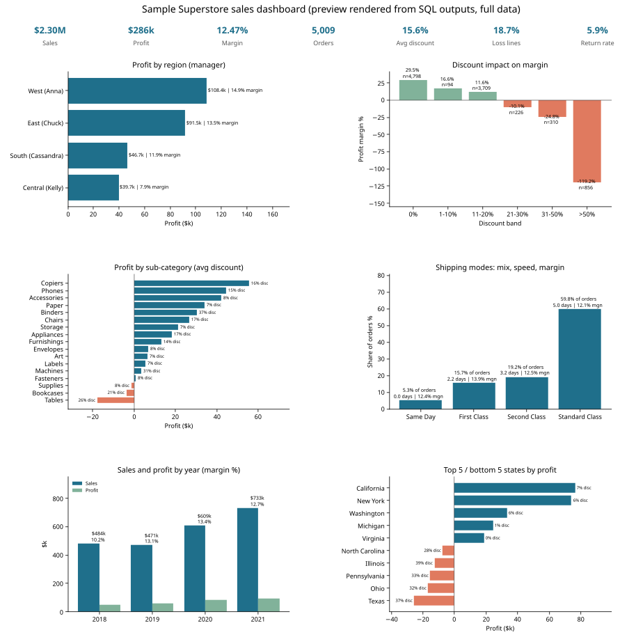

# Results - full Sample Superstore dataset (9,994 order lines, 2018-2021)

Run: `python run_pipeline.py --source full` on DuckDB 1.5.6 (Python 3.13), 2026-10-02. Every number below is copied from
`results/tables/*.csv` / `metrics.json` produced by that run. Currency: USD.

## Headline KPIs
| KPI | Value |
|---|---|
| Order lines (clean) / orders / customers / products | 9,993 / 5,009 / 793 / 1,894 |
| Total sales | **$2,296,919.61** |
| Total profit | **$286,409.08** |
| Profit margin | **12.47 %** |
| Average order value | $458.56 |
| Average discount | 15.62 % |
| Loss-making lines | 18.71 % (profit given away on them: $156.1k) |
| Order return rate | 5.91 % of orders ($180,504 of sales on returned orders) |
| Average ship time | 3.96 days |
| Period | 2018-01-03 to 2021-12-30 |

## Key findings
1. **Regional profit.** West **$108,418 (14.94 %)**, East **$91,535 (13.49 %)**, South **$46,749 (11.93 %)**, Central **$39,706 (7.92 %)**.
   Central has the highest average discount (24.04 % vs 10.93 % in West), which explains most of its margin gap.
2. **Discount impact.** Margin by discount band: 0 % -> **29.51 %**, 1-10 % -> 16.61 %, 11-20 % -> 11.58 %, 21-30 % -> **-10.06 %**,
   31-50 % -> **-24.80 %**, >50 % -> **-119.20 %**. Every line discounted above 50 % (856 lines) loses money; together the >20 % bands lose **$135.4k**.
3. **Where money is lost.** Sub-categories: Tables **-$17,725** (26.1 % avg discount, 77 % of lines discounted), Bookcases -$3,473, Supplies -$1,189.
   States: Texas **-$25,729** (37 % avg discount), Ohio -$16,959, Pennsylvania -$15,560, Illinois -$12,608, North Carolina -$7,491.
   California (+$76,381) and New York (+$74,039) earn the most. Worst single product: Cubify CubeX 3D Printer Double Head (-$8,880 on 3 lines at 53 % avg discount).
4. **Shipping modes.** Standard Class 59.77 % of orders (avg 5.01 days), Second Class 19.25 % (3.24 d), First Class 15.71 % (2.18 d),
   Same Day 5.27 % (0.04 d). Margins are similar (12.08-13.93 %); segment mix is nearly identical (Standard ~59-61 % in every segment).
5. **Growth & segments.** Sales 2018 $483,966 -> 2019 $470,532 (-2.78 %) -> 2020 $609,206 (+29.47 %) -> 2021 $733,215 (+20.36 %).
   Home Office has the best margin (14.05 %), Consumer the most sales ($1.16M, 11.55 %). West's order return rate (11.73 %) is ~3.5x other regions.

## Data quality (what the cleaning found / did)
| Entity | Raw rows | Clean rows | Treatment |
|---|---|---|---|
| orders | 9,994 | 9,993 | 1 exact duplicate line removed; 5,296 float artefacts rounded; 438 postal codes re-padded; 11 missing postal codes kept |
| returns | 800 | 296 | collapsed to order grain (504 repeated rows); 0 orphan orders |
| people | 4 | 4 | trimmed; exactly 1 manager per region |
| fact_sales | - | 9,993 | joined to 5 dims, 0 orphan keys |

Other findings: 32 product IDs map to 2 different product names (dimension keyed on id + name); 0 customers with conflicting names/segments;
0 ship-before-order rows; 668 sales IQR outliers and 200 profit p1/p99 extremes flagged (kept).
**All 12 assertions in `dq_assertions` PASS.**

Cross-engine check: the same SQL ran on a Databricks serverless SQL warehouse; all 12 core table row counts match, and
`a_kpi_headline`, `a_region_performance`, `a_discount_impact`, `a_ship_mode`, `dq_assertions` match cell-for-cell
(only `percentile_approx`-based profit-extreme flag differs: 198 vs 200). See `../databricks/run_outputs/duckdb_vs_databricks.json`.

## Charts (SVG, vector only)
`charts/dashboard.svg` (6-panel preview) and `region_profit.svg`, `discount_impact.svg`, `subcategory_profit.svg`,
`ship_mode.svg`, `yearly_trend.svg`, `state_profit.svg`.

## Files
* `metrics.json` - all KPIs + data-quality stats + table row counts + engine/timings
* `JSON.shot` - headline KPI snapshot + key breakdowns + run config (valid JSON)
* `tables/` - every `a_*` (analysis) and `dq_*` (quality) table as CSV - written by `run_pipeline.py --source full` (not committed; the same values are in `metrics.json`, `JSON.shot` and `../databricks/run_outputs/`)
* `sample/JSON.shot` - the same pipeline on the 66-line repo subset (`--source sample`) for verification, not for insight
